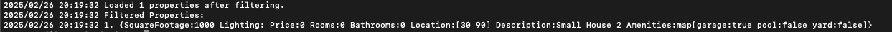
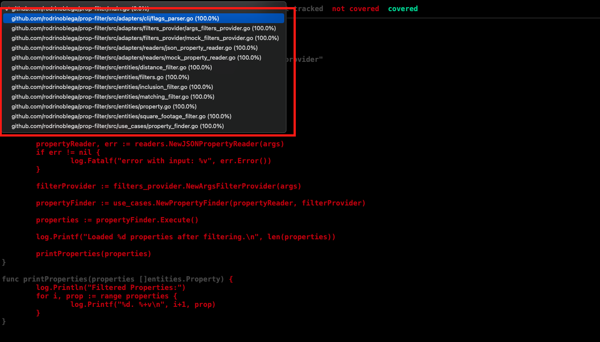

# Property Filter CLI - prop-filter


Command-line tool to filter a large set of real estate properties based on their particular attributes

Features:
- Filter properties by square footage, distance, amenities, and description.
- Support for complex filtering rules.
- Efficient and scalable processing using workers and parallel execution.
- Easily configurable and extensible architecture.

## Clean Architecture

The architecture is based on the concept of Clean Architecture. Clean Architecture is a software design principle to create a clear separation between different components of an application. This structure enhances maintainability, testability, and scalability by defining clear boundaries between layers.

**Organizing the code into distinct layers ensures that the business logic remains independent of external frameworks or infrastructure, making it easier to adapt to future changes, such as switching from one external tool (e.g., PostgreSQL) to another (e.g., MongoDB), without impacting the core application logic.**
The architecture consists of four main layers:

- Entities: Core business logic and data structures.
- Use Cases: Defines the application’s specific business rules and the interactions between entities.
- Adapters: Interfaces to external systems and tools.
- Frameworks: Handles external dependencies and integrations.

Note on Frameworks Layer
  In this project, the Frameworks layer was not necessary, as there were no direct external dependencies that required specific handling. This layer can be added later if new dependencies like databases or web frameworks are introduced.


### Architecture diagram


### Additional Notes

This architecture follows the Dependency Rule, ensuring that inner layers remain independent of outer layers. Any dependency on external layers is managed through interfaces, making the system scalable and easily interchangeable. This design allows modifications to be made in outer layers without affecting core business logic, ensuring maintainability and flexibility in future enhancements.


## Application Flow

The application follows a structured execution flow to efficiently filter properties:

- Load Properties: Reads property data from a JSON file via CLI arguments, streaming through a channel to optimize memory usage.
- Parse Filters: Extracts filter criteria (square footage, amenities, location, etc.) from CLI arguments.
- Process Properties: Uses parallel processing to apply filters efficiently across multiple goroutines.
- Handle Errors: Errors are logged asynchronously without interrupting execution.
- Display Results: The filtered properties are collected and displayed, along with the total count.

### Parallel Processing with Workers
  
To efficiently process large datasets, the application utilizes goroutine-based workers:

- Streaming Input: Properties are read in chunks via channels, reducing memory overhead.
- Concurrent Filtering: Multiple workers apply filters in parallel, improving performance.
- Optimized Processing: Workers fetch and evaluate properties dynamically, ensuring fast execution.

This architecture ensures scalability and efficient processing.

### Flow sequence diagram


## How to run the application

### Prerequisites

Ensure you have the following installed before running the application:
- Go (version 1.23 or later)
- A terminal with access to run CLI commands
- Git (for cloning the repository)
- Docker (if running with a container)

### Option 1: Run Locally

1- Clone the repository:

``` 
git clone https://github.com/rodrinoblega/prop-filter.git 
```

``` 
cd prop-filter 
```

2- Build the application:

``` 
go build -o prop-filter 
```

3- Run the application:

``` 
./prop-filter --input=<your-file>.json  
```

Ensure that ``` <your-file>.json ``` is in the same directory as the executable or provide the full path.

### Option 2: Run with Docker (Build Locally)

1- Build the Docker image:

``` 
docker build -t prop-filter . 
```

2- Run the application with a JSON file:

``` 
docker run --rm -v $(pwd)/<your-file>.json:/app/<your-file>.json prop-filter --input=/app/<your-file>.json 
```

Make sure that <your-file>.json exists in the current directory before running the command.

### Option 3: Run with Docker (Pull from Docker Hub)

1- Pull the latest image from Docker Hub:

``` 
docker pull rnoblega/prop-filter:latest 
```

2-  Run the application without building it locally:

``` 
docker run --rm -v $(pwd)/<your-file>.json:/app/<your-file>.json rnoblega/prop-filter:latest --input=/app/<your-file>.json 
```

### Additional notes
- Ensure that ``` <your-file>.json ``` is a valid JSON file formatted correctly according to the expected schema.
- When using Docker, always mount the file with ``` -v $(pwd)/<your-file>.json:/app/<your-file>.json ``` to ensure the container can access it.

### Usage

To filter properties, use the CLI with these optional parameters:

| Parameter          | Description                                                | Required Together                                      | Example                                   |
|--------------------|------------------------------------------------------------|--------------------------------------------------------|-------------------------------------------|
| ```--minSqFt ```   | Minimum square footage                                     | No                                                     | ```--minSqFt=500 ```                      |
| ```--maxSqFt ```   | Maximum square footage                                     | No                                                     | ```--maxSqFt=500 ```                      |
| ```--amenities ``` | Comma-separated list of amenities with true/false values   | No                                                     | ```--amenities=garage:true,pool:false ``` |
| ```--contains ```  | Filters descriptions that contain the specified word       | No                                                     | ```--contains=ocean view ```              |
| ```--lat ```       | Latitude for location-based filtering                      | Yes (--lat, --lon, and --maxDist must all be provided) | ```--lat=37 ```                           |
| ```--lon ```       | Longitude for location-based filtering                     | Yes (--lat, --lon, and --maxDist must all be provided) | ```--lon=-122 ```                         |
| ```--maxDist ```   | Maximum distance in kilometers from the specified location | Yes (--lat, --lon, and --maxDist must all be provided) | ```--maxDist=10 ```                       |

### Additional Notes:
- The ```--amenities ``` flag requires a list of key-value pairs where the key is the amenity name and the value is true or false. If a property has the specified amenity and its value matches the filter, it is included in the results.
- The location-based filtering (```--lat ```, ```--lon ```, and ```--maxDist ```) only works if all three parameters are provided. If any of them are missing, the location filter is ignored.
- If ```--minSqFt ``` or ```--maxSqFt ``` is not provided, that constraint will not be applied to the results.

### Examples
Input JSON file
```
[
  {"description": "Small House 1", "squareFootage": 900, "location": [20, 80], "amenities": {"yard": false,"garage": true,"pool": false}},
  {"description": "Small House 2", "squareFootage": 1000, "location": [30, 90], "amenities": {"yard": false,"garage": true,"pool": false}},
  {"description": "Small House 3", "squareFootage": 1100, "location": [40, 100], "amenities": {"yard": false,"garage": true,"pool": true}},
  {"description": "Medium House 1", "squareFootage": 2100, "location": [120, -220], "amenities": {"yard": true,"garage": true,"pool": false}},
  {"description": "Medium House 2", "squareFootage": 2200, "location": [130, -234], "amenities": {"yard": false,"garage": true,"pool": true}},
  {"description": "Medium House 3", "squareFootage": 2499, "location": [145, -240], "amenities": {"yard": false,"garage": true,"pool": false}},
  {"description": "Large House 1", "squareFootage": 2500, "location": [190, -250], "amenities": {"yard": true,"garage": true,"pool": false}},
  {"description": "Large House 2", "squareFootage": 2500, "location": [195, -238], "amenities": {"yard": false,"garage": true,"pool": false}},
  {"description": "Large House 3", "squareFootage": 2500, "location": [192, -241], "amenities": {"yard": true,"garage": true,"pool": false}},
  {"description": "Large House 4 ", "squareFootage": 2500, "location": [188, -259], "amenities": {"yard": false,"garage": true,"pool": false}}
]
```

#### Case 0 : No filters applied

Run Locally:
````
./prop-filter --input=properties.json
````

Run with Docker (Local Build):
````
docker run --rm -v $(pwd)/properties.json:/app/properties.json prop-filter --input=properties.json

````
Run with Docker (Pulled Image):
````
docker run --rm -v $(pwd)/properties.json:/app/properties.json rnoblega/prop-filter:latest --input=properties.json

````

Result: 


#### Case 1 : Filtering by minimum square footage and specific amenities (with pool and garage)

Run Locally:
````
./prop-filter --input=properties.json --minSqFt=1000 --amenities=garage:true,pool:true
````

Run with Docker (Local Build):
````
docker run --rm -v $(pwd)/properties.json:/app/properties.json prop-filter --input=/app/properties.json --amenities=garage:true,pool:true

````
Run with Docker (Pulled Image):
````
docker run --rm -v $(pwd)/properties.json:/app/properties.json rnoblega/prop-filter:latest --input=/app/properties.json --amenities=garage:true,pool:true    

````

Result:


#### Case 2 : Filtering by exact square footage

Run Locally:
````
./prop-filter --input=properties.json --minSqFt=1000 --maxSqFt=1000
````

Run with Docker (Local Build):
````
docker run --rm -v $(pwd)/properties.json:/app/properties.json prop-filter --input=/app/properties.json --minSqFt=1000 --maxSqFt=1000

````
Run with Docker (Pulled Image):
````
docker run --rm -v $(pwd)/properties.json:/app/properties.json rnoblega/prop-filter:latest --input=/app/properties.json --minSqFt=1000 --maxSqFt=1000    

````

Result:



#### Case 3 : Filtering by distance
Note: The application uses the Haversine formula to calculate the great-circle distance between two geographic points (latitude and longitude). This allows the application to filter properties based on their distance from a specified location.

Run Locally:
````
./prop-filter --input=properties.json --lat=100 --lon=150 --maxDist=7000
````

Run with Docker (Local Build):
````
docker run --rm -v $(pwd)/properties.json:/app/properties.json prop-filter --input=/app/properties.json --lat=100 --lon=150 --maxDist=7000

````
Run with Docker (Pulled Image):
````
docker run --rm -v $(pwd)/properties.json:/app/properties.json rnoblega/prop-filter:latest --input=/app/properties.json --lat=100 --lon=150 --maxDist=7000

````


#### Case 4 : Filtering by a specific string in the description attribute

Run Locally:
````
./prop-filter --input=properties.json --contains=Small house
````

Run with Docker (Local Build):
````
docker run --rm -v $(pwd)/properties.json:/app/properties.json prop-filter --input=/app/properties.json --contains=Small house

````
Run with Docker (Pulled Image):
````
docker run --rm -v $(pwd)/properties.json:/app/properties.json rnoblega/prop-filter:latest --input=/app/properties.json --contains=Small house

````

Result:


#### Case 5 : No input

Run Locally:
````
./prop-filter 
````

Run with Docker (Local Build):
````
docker run --rm -v $(pwd)/properties.json:/app/properties.json prop-filter 

````
Run with Docker (Pulled Image):
````
docker run --rm -v $(pwd)/properties.json:/app/properties.json rnoblega/prop-filter:latest

````

Result:


#### Case 6 : Invalid argument

Run Locally:
````
./prop-filter --input=properties.json --flag=invalid
````

Run with Docker (Local Build):
````
docker run --rm -v $(pwd)/properties.json:/app/properties.json prop-filter --input=properties.json --flag=invalid

````
Run with Docker (Pulled Image):
````
docker run --rm -v $(pwd)/properties.json:/app/properties.json rnoblega/prop-filter:latest --input=properties.json --flag=invalid

````

Result:


## Testing strategy

This project follows a robust testing approach to ensure the reliability and correctness of the filtering logic.

- 100% Unit Test Coverage: The core business logic is fully covered with unit tests, ensuring that all filtering operations work correctly in isolation.
- Integration Tests: The project includes integration tests that validate the full business flow, ensuring that filters work together as expected when applied in combination.

### How to run tests

```
go test ./... -coverpkg=./... -coverprofile=coverage.out
```

```
go tool cover -html=coverage.out
```

These commands will generate a coverage report highlighting a high percentage of their lines covered by tests.




## External Libraries Used

This project primarily relies on Go’s standard library, with the exception of:
- Testify: Used for writing expressive and maintainable tests, providing assertions and test suite functionality.

## Questions

* [rnoblega@gmail.com](rnoblega@gmail.com)


