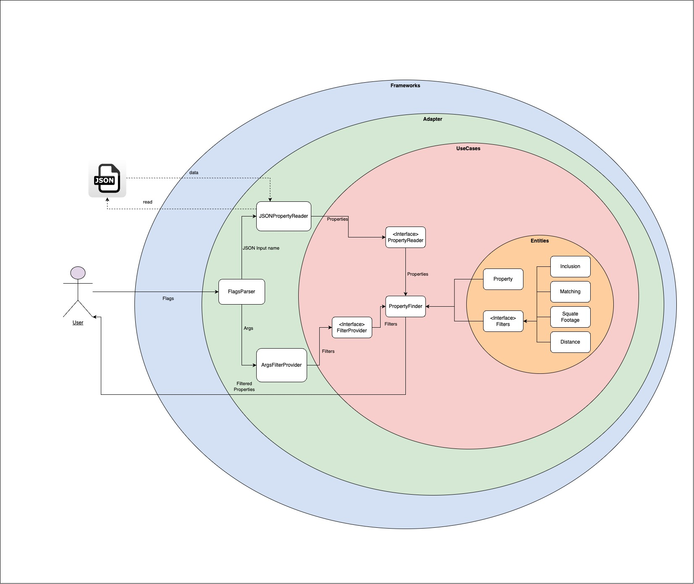

# Property Filter CLI - prop-filter


Command-line tool to filter a large set of real estate properties based on their particular attributes

Features:
- Filter properties by square footage, distance, amenities, and description.
- Support for complex filtering rules.
- Efficient and scalable processing using workers and parallel execution.
- Easily configurable and extensible architecture.

## Clean Architecture

The architecture is based on the concept of Clean Architecture. Clean Architecture is a software design principle to create a clear separation between different components of an application. This structure enhances maintainability, testability, and scalability by defining clear boundaries between layers.

**Organizing the code into distinct layers ensures that the business logic remains independent of external frameworks or infrastructure, making it easier to adapt to future changes, such as switching from one external tool (e.g., PostgreSQL) to another (e.g., MongoDB), without impacting the core application logic.**
The architecture consists of four main layers:

- Entities: Core business logic and data structures.
- Use Cases: Defines the application’s specific business rules and the interactions between entities.
- Adapters: Interfaces to external systems and tools.
- Frameworks: Handles external dependencies and integrations.

Note on Frameworks Layer
  In this project, the Frameworks layer was not necessary, as there were no direct external dependencies that required specific handling. This layer can be added later if new dependencies like databases or web frameworks are introduced.


### Architecture diagram




### Additional Notes

This architecture adheres to the Dependency Rule, ensuring that inner layers do not depend on outer layers. Any dependency on external layers is managed through interfaces, making the system scalable and easily interchangeable. This design allows modifications to be made in outer layers without affecting core business logic, ensuring maintainability and flexibility in future enhancements.


## Application Flow

The application follows a structured execution flow to efficiently filter properties based on user-provided criteria:

1- Load Properties:
- The JSONPropertyReader reads property data from a JSON file specified via command-line arguments.
- If no filename is provided, the program will return an error.
- It streams properties through a channel to avoid loading everything into memory at once.
- Errors encountered while reading are sent to an error channel.

2- Parse Filters:
- The ArgsFilterProvider parses command-line arguments and constructs the necessary filters.
- Filters include criteria like square footage, amenities, keywords, and location-based filtering.

3- Process Properties:
- The PropertyFinder orchestrates the filtering process.
- It spawns multiple worker goroutines to apply filters in parallel for better performance.
- Each property is checked against the filter criteria, and matching properties are sent to a results channel.

4- Handle Errors:
- A separate goroutine listens for errors and logs them without interrupting execution.

5- Collect Results and Display Output:
- The results channel is processed, collecting the final list of filtered properties.
- The application prints the filtered properties and logs the total count.

### Parallel Processing with Workers
To efficiently handle large volumes of data, the application utilizes multiple workers running in parallel. The process works as follows:

- Property Loading:
Properties are read from the JSON file and sent through a channel to avoid loading everything into memory at once.

- Task Distribution:
A pool of goroutines (workers) retrieves properties from the channel and applies the filtering criteria in parallel.
Once a worker completes processing a property, it immediately retrieves the next available property to maximize efficiency.

- Criteria Evaluation:
Each worker checks whether a property meets the specified filters set by the user.

- Result Collection:
Properties that pass the filtering criteria are sent to another channel, where they are aggregated and printed as output.

This worker-based approach ensures better scalability and efficiency, as it allows filtering operations to be performed concurrently, reducing execution time for large property datasets.

## How to run the application

### Prerequisites

Ensure you have the following installed before running the application:
- Go (version 1.23 or later)
- A terminal with access to run CLI commands
- Git (for cloning the repository)
- Docker (if running with a container)

### Option 1: Run Locally

1- Clone the repository:

``` 
git clone https://github.com/rodrinoblega/prop-filter.git 
```

``` 
cd prop-filter 
```

2- Build the application:

``` 
go build -o prop-filter 
```

3- Run the application:

``` 
./prop-filter --input=<your-file>.json  
```

Make sure ``` <your-file>.json ``` is in the same directory or provide the full path.

### Option 2: Run with Docker (Build Locally)

1- Build the Docker image:

``` 
docker build -t prop-filter . 
```

2- Run the application with a JSON file:

``` 
docker run --rm -v $(pwd)/<your-file>.json:/app/<your-file>.json prop-filter --input=/app/<your-file>.json 
```

Ensure ``` <your-file>.json ``` exists in the current directory.

### Option 3: Run with Docker (Pull from Docker Hub)

1- Pull the latest image from Docker Hub:

``` 
docker pull rodrinoblega/prop-filter:latest 
```

2-  Run the application without building it locally:

``` 
docker run --rm -v $(pwd)/<your-file>.json:/app/<your-file>.json rodrinoblega/prop-filter:latest --input=/app/<your-file>.json 
```

### Additional notes
- Ensure that ``` <your-file>.json ``` is a valid JSON file formatted correctly according to the expected schema.
- When using Docker, always mount the file with ``` -v $(pwd)/<your-file>.json:/app/<your-file>.json ``` to ensure the container can access it.

### Usage

To filter properties, use the CLI with this optional parameters:

| Parameter          | Description                                                | Required Together                                      | Example                                   |
|--------------------|------------------------------------------------------------|--------------------------------------------------------|-------------------------------------------|
| ```--minSqFt ```   | Minimum square footage                                     | No                                                     | ```--minSqFt=500 ```                      |
| ```--maxSqFt ```   | Maximum square footage                                     | No                                                     | ```--minSqFt=500 ```                      |
| ```--amenities ``` | Comma-separated list of amenities with true/false values   | No                                                     | ```--amenities=garage:true,pool:false ``` |
| ```--contains ```  | Filters descriptions that contain the specified word       | No                                                     | ```--contains=ocean view ```              |
| ```--lat ```       | Latitude for location-based filtering                      | Yes (--lat, --lon, and --maxDist must all be provided) | ```--lat=37 ```                           |
| ```--lon ```       | Longitude for location-based filtering                     | Yes (--lat, --lon, and --maxDist must all be provided) | ```--lon=-122 ```                         |
| ```--maxDist ```   | Maximum distance in kilometers from the specified location | Yes (--lat, --lon, and --maxDist must all be provided) | ```--maxDist=10 ```                       |

### Additional Notes:
- The ```--amenities ``` flag requires a list of key-value pairs where the key is the amenity name and the value is true or false. If a property has the specified amenity and its value matches the filter, it is included in the results.
- The location-based filtering (```--lat ```, ```--lon ```, and ```--maxDist ```) only works if all three parameters are provided. If any of them are missing, the location filter is ignored.
- If ```--minSqFt ``` or ```--maxSqFt ``` is not provided, that constraint will not be applied to the results.

### Examples

## Testing strategy

This project follows a robust testing approach to ensure the reliability and correctness of the filtering logic.

- 100% Unit Test Coverage: The core business logic is fully covered with unit tests, ensuring that all filtering operations work correctly in isolation.
- Integration Tests: The project includes integration tests that validate the full business flow, ensuring that filters work together as expected when applied in combination.

### How to run tests

```
go test ./... -coverpkg=./... -coverprofile=coverage.out
```

```
go tool cover -html=coverage.out
```

These commands will generate a coverage report highlighting a high percentage of their lines covered by tests.


## External Libraries Used

This project primarily relies on Go’s standard library, with the exception of:
- Testify: Used for writing expressive and maintainable tests, providing assertions and test suite functionality.

## Questions

* [rnoblega@gmail.com](rnoblega@gmail.com)


